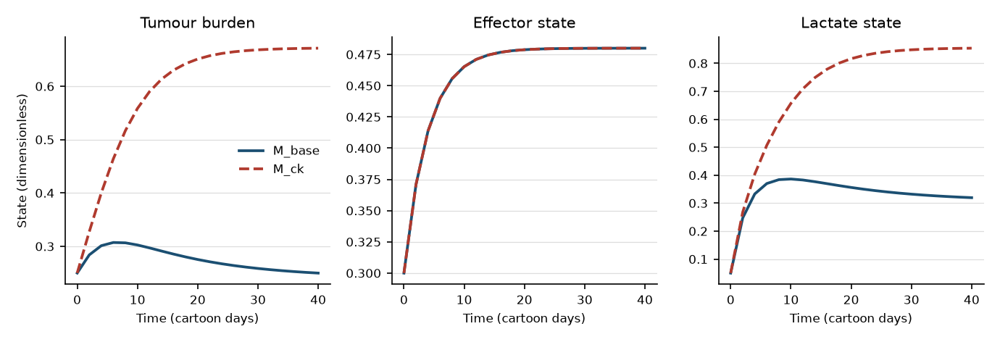
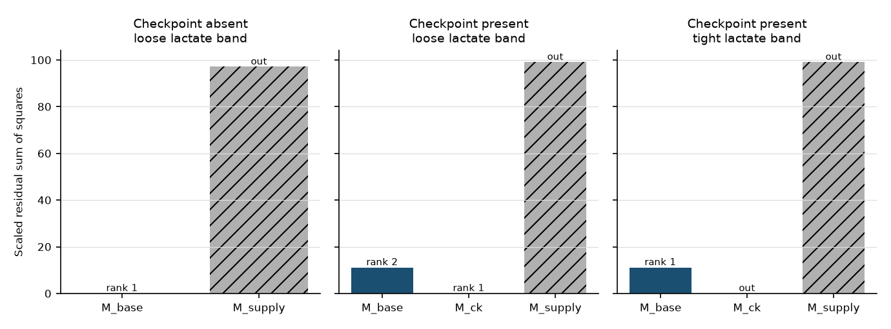
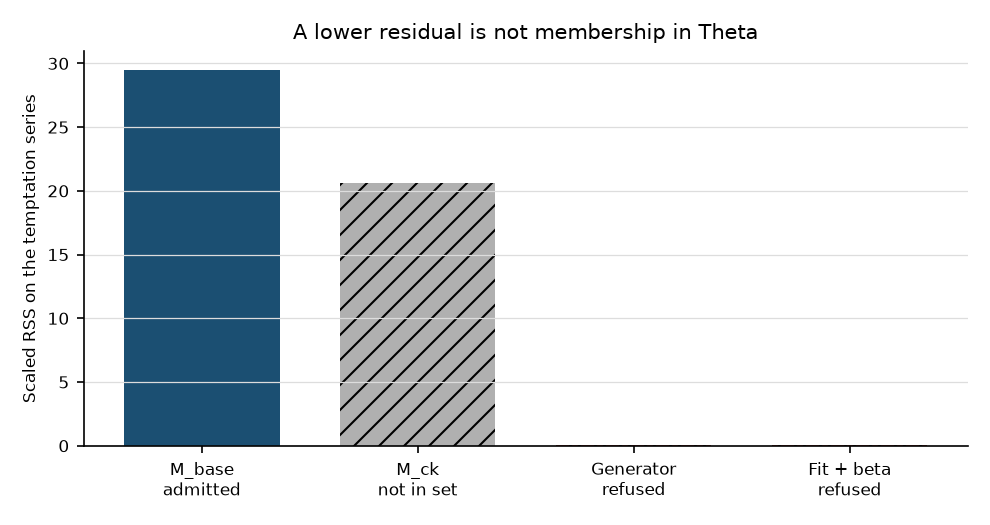

# Immunometabolic tumour-immune interaction ODEs under explicit non-parameters: lactate, checkpoint proxies, and host constraints that must not enter Θ

**Thesis #10 (was R3). Computational research thesis**  
**Author:** Kelechi Emeka Ogbonna  
**Correspondence:** kelechiogbonna300@gmail.com · https://github.com/cloudynirvana/thesis-10-immunometabolic-refuse-as-parameter  
**Date:** 21 September 2026  
**Format:** B.Sc. project chapter structure (Nile University style) for journal or thesis handoff  
**Status:** In-silico ledger on a toy ODE. Not a clinical result. Not a wet-lab study.  
**Citation style:** numbered Vancouver [n]. DOI fields appear only for Crossref-verified journal records. Print years are used where Crossref separates print from online dates.  
**DOI:** none registered for this document. Do not invent one.

---

## Title page

**IMMUNOMETABOLIC TUMOUR-IMMUNE INTERACTION ODES UNDER EXPLICIT NON-PARAMETERS: LACTATE, CHECKPOINT PROXIES, AND HOST CONSTRAINTS THAT MUST NOT ENTER Θ**

BY

**KELECHI EMEKA OGBONNA**

A COMPUTATIONAL RESEARCH THESIS  
(IN-SILICO METHODS STUDY)

SUBMITTED AS A CITEABLE MANUSCRIPT FOR JOURNAL OR THESIS HANDOFF

INDEPENDENT COMPUTATIONAL RESEARCH

SUPERVISOR: not appointed for this computational deposit

SEPTEMBER 2026

---

## Declaration

I, Kelechi Emeka Ogbonna, declare that this computational research thesis was carried out by me. The findings are in-silico ranks and refusals on a toy ordinary differential equation. They are not wet-lab measurements, not patient outcomes, and not a claim of cure, dose, or clinical decision support. No identifier (DOI, ORCID, or journal acceptance) has been invented. Lactate, checkpoint labels, and host bounds are evidence objects in a ledger. They are not prescriptions.

_________________________     _______________________  
Kelechi Emeka Ogbonna         Date

---

## Abstract

Can lactate, checkpoint proxies, and host constraints stay as refuse-as-parameter evidence objects that change hypothesis rank without entering Θ as kinetic parameters?

This study answers on a three-state cartoon. Tumour burden, an effector state, and a lactate state obey a fixed kinetic vector of length 7. A second structure uses the same vector, with kill scaled by a ledger constant 0.55. A checkpoint label decides whether that second structure is a candidate. A host budget on effector supply, and a host band on terminal lactate, decide which candidates may be ranked. Rank inside the admissible set is a scaled residual sum of squares on synthetic series (3% multiplicative noise; seeds 20260921, 20260922, and 20260923).

With the label absent and a wide lactate band, the baseline structure ranks first (scaled RSS 0.0495). With the label present and the same wide band, the scaled-kill structure ranks first (scaled RSS 0.0538) and the baseline falls to second (scaled RSS 11.16). With the label present and a tight band, the scaled-kill structure is inadmissible despite that residual, and the baseline ranks first again. A third hypothesis, with supply fixed above the host budget, is inadmissible in every scenario. Θ does not grow.

A separate series is generated with an extra lactate-suppression coefficient equal to 0.35. The legal baseline residual on that series is 29.46. The generating coefficient brings the residual to 0.0581, near the noise floor. A local least-squares fit of the seven kinetics plus the extra coefficient reaches 0.0489, with the coefficient estimated at 0.396 and with large shifts in growth and kill. The ledger refuses the write. A numerical Fisher matrix on the legal vector has rank 6 of 7 under a relative eigenvalue cutoff. The weak direction is the carrying capacity.

The positive result is the rank change. The negative result is the blocked promotion. Research only. Not a medical device, not clinical decision support, not a dose, and not a cure.

---

## Keywords

immunometabolism; lactate; tumour-immune ODE; checkpoint proxy; host constraint; hypothesis rank; Fisher information; refuse-as-parameter; computational methods; research-only

---

## Table of Contents

DECLARATION  
ABSTRACT  
Table of Contents  
List of tables and figures  

CHAPTER ONE. INTRODUCTION  
 1.1 Background to the study  
 1.2 STATEMENT OF RESEARCH PROBLEM  
 1.3 JUSTIFICATION OF STUDY  
 1.4 AIM AND OBJECTIVES OF THE STUDY  
 1.5 SIGNIFICANCE OF THE STUDY  
 1.6 SCOPE OF THE STUDY  

CHAPTER TWO. LITERATURE REVIEW  
 2.1 What already sits in a parameter vector  
 2.2 Lactate as an observation, and as a shortcut  
 2.3 A checkpoint proxy is a label  
 2.4 Host constraints  
 2.5 Why a better residual is not a promotion  

CHAPTER THREE. MATERIALS AND METHODS  
 3.1 Design  
 3.2 The legal equation and the two structures  
 3.3 Ledger rules  
 3.4 Noise, rank, the illegal fit, and the Fisher sketch  
 3.5 What was not done  

CHAPTER FOUR. RESULTS  
 4.1 Trajectories  
 4.2 Rank under the ledger  
 4.3 Illegal promotion  
 4.4 Fisher rank on the legal vector  

CHAPTER FIVE. DISCUSSION, CONCLUSION AND RECOMMENDATION  
 5.1 Discussion  
 5.2 Conclusion  
 5.3 Recommendation  

REFERENCES  
DISCLAIMER  

---

## List of tables and figures

**Table 3-1.** Legal kinetic values.  
**Table 3-2.** Ledger constants. These are not in Θ.  
**Table 4-1.** Noise-free terminal states at t = 40.  
**Table 4-2.** Hypothesis rank on the two observation series.  
**Table 4-3.** Scaled residuals on the temptation series.  
**Table 4-4.** Generating coordinates and the refused least-squares point.  
**Table 4-5.** Gate decisions.

**Figure 4-1.** Noise-free state trajectories.  
**Figure 4-2.** Scaled residual by scenario. Inadmissible hypotheses are hatched.  
**Figure 4-3.** Temptation residuals. Refused calculations are marked.

Numbers in Chapter Four are rounded from `sim/results.json`. They are computational. They are not patient outcomes.

---

# CHAPTER ONE

## 1.0 INTRODUCTION

### 1.1 Background to the study

Tumour-immune interaction already has a differential-equation literature. Kuznetsov and colleagues estimated parameters for a nonlinear immunogenic-tumour model and tracked its bifurcations [1]. Kirschner and Panetta wrote an immunotherapy interaction as an ODE [2]. de Pillis, Radunskaya, and Wiseman compared a cell-mediated response model with tumour-growth data [3]. Later reviews and cartoons kept proliferation, recruitment, and killing inside a parameter vector [4-7].

Aerobic glycolysis is a separate literature. Warburg, Vander Heiden and colleagues, Gatenby and Gillies, and Pavlova and Thompson describe why proliferating cells make lactate [8-11]. Another group of papers treats lactate as something immune cells experience. Fischer and colleagues reported that tumour-cell lactic acid inhibited human T cells [12]. Colegio and colleagues reported macrophage polarisation by tumour-derived lactic acid [13]. Brand and colleagues linked LDHA-associated lactic acid to weaker T and NK surveillance in their melanoma models [14]. Chang and colleagues described metabolic competition in the tumour microenvironment [15]. Faubert and colleagues measured lactate metabolism in human lung tumours [16]. Watson and colleagues reported lactic acid as metabolic support for tumour-infiltrating regulatory T cells [17]. Cascone and colleagues associated higher tumour glycolysis with poorer responses to adoptive T-cell transfer in their experimental system [18].

Checkpoint biology is a third literature. It is not itself a rate constant. Pardoll reviewed checkpoint blockade [19]. Wherry and Kurachi reviewed T-cell exhaustion [20]. Sharma and colleagues classed resistance to immunotherapy as primary, adaptive, or acquired [21]. Topalian, Drake, and Pardoll reviewed blockade as a therapeutic approach [22]. Ribas and Wolchok did the same for a later readership [23]. Those papers are context for a label. They are not a dosing table. This thesis does not derive one from them.

Host state is a fourth object. Fearon, Arends, and Baracos described cancer cachexia as a systemic metabolic condition [24]. Their review also discusses treatment options. This manuscript does not adopt that discussion and does not recommend an intervention.

Identifiability theory asks whether an experiment can pin a parameter down, even before noise is considered [25]. Profile likelihood and sloppy spectra ask the practical version of that question [26-28]. Saltelli and colleagues, and May, argued that a calculation can succeed numerically and still answer the wrong question [29,30]. The wrong question, in the habit tested here, is which extra coefficient buys the smallest residual.

### 1.2 STATEMENT OF RESEARCH PROBLEM

Can lactate, checkpoint proxies, and host constraints stay as refuse-as-parameter evidence objects that change hypothesis rank without entering Θ as kinetic parameters?

That is the research question. It concerns symbol membership on a toy ODE. It does not ask how to dose a checkpoint antibody, and it does not ask whether a patient's lactate should be lowered [19,23].

The habit under test is easy to state. A resistance cartoon needs a weaker immune effect, so a coefficient is added and fitted. Lactate can supply that coefficient. A checkpoint label can supply another. A host bound can be turned into a fitted ceiling. Each symbol can instead be stored as an evidence object. The object may change which pre-registered hypothesis is admissible, or which admissible hypothesis ranks first.

What counts as an answer is a change in rank with those seven kinetic names held fixed. A smaller residual is not that answer when the price is an extra symbol in Θ.

### 1.3 JUSTIFICATION OF STUDY

The study is justified by a mismatch. The equation class is old enough to hide a promotion [1-7]. The lactate and checkpoint papers are full of observations [12-23]. Neither fact tells a fitter where a symbol is allowed to live.

Practical identifiability work has already shown that biological ODEs can look settled while some directions stay flat or sloppy [26,28]. A three-state cartoon is small enough for the membership question to be audited by hand. The audit is justified by what Chapter Four finds. An enlarged vector can reach the noise floor while growth and kill move far from the values that generated the series. A methods deposit is a reasonable place to keep that pair of facts in view.

There is a second, negative justification. Blockade reviews and the cachexia review are not a licence to recommend a drug, a schedule, or a nutritional plan [19,23,24]. The same ledger that blocks a parameter write can block that reading.

### 1.4 AIM AND OBJECTIVES OF THE STUDY

The aim is to test whether a lactate series, a checkpoint label, and a host inequality can change hypothesis rank on a frozen tumour-immune-lactate ODE while remaining outside Θ.

The objectives are to:

i. Write a three-state ODE whose legal parameter vector contains only kinetic coefficients.  
ii. Declare two frozen structures that share that vector, one of them scaled by a ledger constant.  
iii. Rank those structures, and one supply alternative, under a checkpoint label and under two host lactate bands.  
iv. Generate a series from a lactate-suppression term, fit that term, and record the residual.  
v. Block any proposal that would write the refused names into Θ.  
vi. Compute a numerical Fisher rank on the legal vector, then again after a refused column is added and dropped.

Non-aims follow from the aim. The study does not fit a cell-line time series. It does not estimate a blockade dose. It does not map the dimensionless lactate state onto millimolar blood lactate. It does not run a symbolic identifiability algebra. It does not compute a profile likelihood. Profile likelihood, as set out by Raue and colleagues, is named in Chapter Two and left unrun [26]. No document DOI is minted.

### 1.5 SIGNIFICANCE OF THE STUDY

Chapter Four keeps the rank and the refusal in one place. When the checkpoint label is absent and the lactate band is wide, the baseline structure ranks first. When the label is present and the band stays wide, the scaled-kill structure ranks first. When the band is tight, that scaled-kill structure is removed even though its residual sits near the noise floor, and the baseline ranks first again. In each accepted ranking the kinetic names are the same seven.

The refusal is the other half of the result. On a series generated with a lactate-suppression coefficient, a least-squares fit of that coefficient reaches the noise floor at a kinetic point that is not the generating point. The ledger does not store the coefficient. Both facts stay visible: the residual improved, and the write was blocked.

Nothing in that pair is a survival difference, a biomarker cut-off, or a treatment effect [29].

### 1.6 SCOPE OF THE STUDY

The calculation covers one dimensionless ODE. It covers two frozen structures, a categorical checkpoint proxy, two pre-registered lactate bands, and one ceiling on effector supply. Noise is multiplicative and Gaussian, with coefficient of variation 0.03. The seeds are 20260921, 20260922, and 20260923. The fit is local. The Fisher matrix is a finite-difference sketch.

Patients, organ anatomy, spatial transport, receptor occupancy, antibody clearance, and schedules of administration are outside the study. The proxy has the levels absent and present. It does not have a milligram strength. Current results are computational unless a cited paper is explicitly a laboratory report. Those reports are not reanalysed here.

---

# CHAPTER TWO

## 2.0 LITERATURE REVIEW

### 2.1 What already sits in a parameter vector

The models cited in Chapter One do not treat every symbol the same way. Some estimate immune and tumour rates from a chosen output [1,3]. de Pillis, Gu, and Radunskaya later placed immunotherapy and chemotherapy rates inside a mixed-treatment model [31]. That paper studies those rates as mathematics. It is not a regimen, and it is not used as one here.

The question in this thesis sits one step earlier. Before a rate is estimated, someone has to decide that the symbol is a parameter. Lactate slopes, checkpoint labels, and host ceilings are the symbols for which that decision is refused.

### 2.2 Lactate as an observation, and as a shortcut

Three further papers read lactate as a circulating metabolite or as a shuttle, rather than only as an acid surrounding lymphocytes. Liberti and Locasale asked what proliferating cells gain from aerobic glycolysis [32]. Brooks reviewed lactate-shuttle theory [33]. Hui and colleagues reported that circulating lactate can feed the TCA cycle [34].

Immune-cell papers already cited in Chapter One sit next to a wider set. Haas and colleagues reported that lactate regulates metabolic and pro-inflammatory circuits tied to T-cell migration and effector function [35]. Husain and colleagues reported that tumour-derived lactate modifies myeloid-derived suppressor cells and NK cells [36]. Calcinotto and colleagues reported anergy of tumour-infiltrating T lymphocytes under acidity, and reversal of that anergy when acidity was modulated in their experimental system [37]. None of these assays hands over a unique ODE coefficient.

Reviews then draw T-cell metabolism as a map rather than as a single rate. O'Neill, Kishton, and Rathmell wrote a guide for immunologists [38]. MacIver, Michalek, and Rathmell reviewed metabolic regulation of T lymphocytes [39]. Buck, Sowell, Kaech, and Pearce described metabolic instruction of immunity [40]. Wang and Green used the phrase "metabolic checkpoints" for control points inside activated T cells [41]. That phrase is not the categorical proxy in Chapter Three. Siska and Rathmell discussed T-cell metabolic fitness in antitumour immunity [42]. Chang and Pearce reviewed T-cell metabolism in immunotherapy research [43]. Their review is not a target list for this equation, and it is not a dose. Ho and colleagues described phosphoenolpyruvate as a metabolic control point of antitumour T-cell responses [44]. The word is again metabolic. It is not a PD-1 label.

The shortcut refused below is short to write. Put a factor beta in front of L E inside the effector equation, estimate beta, and treat the estimate as immune escape. The papers in this section are compatible with more than one mechanism. One beta is a compression. Chapter Four uses that compression as a data generator. It then refuses to store beta in Θ.

### 2.3 A checkpoint proxy is a label

Chen and Mellman described what they called a cancer-immune set point [45]. This ODE does not estimate that set point. Joyce and Fearon reviewed T-cell exclusion and immune privilege in the microenvironment [46]. Binnewies and colleagues reviewed the tumour immune microenvironment [47]. The title of that review points toward therapy. The citation here is for the cellular setting only. Spranger and Gajewski reviewed oncogenic pathways in relation to evasion of antitumour immune responses [48].

Read with the blockade and exhaustion reviews, these papers make a checkpoint label intelligible [19-23]. They do not fix its units inside an ODE. In this study the label has two values. Present means a pre-registered structure may enter the candidate set. Absent means it may not. The scale factor inside that structure is a ledger constant. It is not a fitted gain, and it is not a milligram quantity.

### 2.4 Host constraints

Hanahan and Weinberg placed recruited stromal and immune cells inside the hallmarks discussion [49]. Anderson and Simon reviewed the tumour microenvironment as a setting rather than as a single rate [50]. Hanahan and Coussens catalogued functions of cells recruited into that setting [51]. Cachexia is the systemic cousin of the local picture, and it was already cited as a description of host state rather than as a plan of care [24].

The toy is narrower than any of those reviews. Effector supply is feasible only when it does not exceed a declared budget. Terminal lactate is feasible only when it lies in a declared band. Neither number is estimated from the series on which hypotheses are ranked. A hypothesis that breaks a rule is reported. It is not given a rank.

### 2.5 Why a better residual is not a promotion

Bellman and Åström posed structural identifiability for parameters of dynamical models [25]. Cobelli and DiStefano reviewed the ambiguities that remain even after that question is posed [52]. Ljung and Glad gave conditions for global identifiability under arbitrary parametrizations [53]. Miao and colleagues reviewed nonlinear ODE identifiability, with viral dynamics as the application [54]. Villaverde, Barreiro, and Papachristodoulou surveyed structural identifiability for dynamic systems-biology models [55].

Profile likelihood is one practical way to tell a flat direction from a bounded valley [26,56]. Raue and colleagues later compared several identifiability procedures on biological systems [57]. This sketch does not repeat that comparison. It uses a residual rank and one Fisher matrix.

Sloppy spectra are a separate warning. Gutenkunst and colleagues reported eigenvalue spreads that leave some parameter combinations weakly determined [28]. Wolkenhauer asked what a model is for, if not for a fitted coefficient count [58]. Transtrum, Machta, and Sethna showed why nonlinear least squares can look successful along directions that are poorly constrained [59]. Chapter Four is built for that warning. A low residual is obtained. The coordinates at that residual are not the generating kinetics. The extra coordinate stays out of Θ.

---

# CHAPTER THREE

## 3.0 MATERIALS AND METHODS

### 3.1 Design

The study is a seeded numerical sketch. States are dimensionless. Time is in cartoon days. No series comes from a patient, a mouse, or a cell-culture plate. Literature in Chapter Two motivates the names of the evidence objects. It does not supply the numerical values in Θ.

Code, seeds, and outputs are `sim/refuse_gate.py`, `sim/results.json`, and `sim/ledger.json`. The seeds are 20260921 for the checkpoint-absent series, 20260922 for the checkpoint-present series, and 20260923 for the temptation series. Integrator tolerances are relative 10^-7 and absolute 10^-9.

### 3.2 The legal equation and the two structures

The state is (T, E, L): tumour burden, effector state, and lactate state. The legal vector is

Θ = (r, K, κ, σ, δ, π, λ).

In the code those names are r, K, kappa, sigma, delta, pi, and lam. The initial state is fixed at (0.25, 0.30, 0.05) and is not part of Θ. The baseline structure M_base is

```
dT/dt = r * T * (1 - T/K) - kappa * E * T
dE/dt = sigma - delta * E
dL/dt = pi * T - lam * L
```

Effector supply does not depend on tumour burden or on lactate. Lactate is produced and cleared. It does not feed back onto the effector equation. That missing feedback is the point. A modeller who wants the feedback has to add a coefficient. The ledger exists to refuse that addition.

The second structure, M_ck, uses the same Θ. Kill is replaced by phi times kappa. The constant phi equals 0.55 and lives on the ledger, so the effective kill coefficient is 0.275. phi is not an eighth parameter. M_ck is available only when the checkpoint evidence object is present.

Table 3-1 gives the numerical Θ used for every legal ranking. These values were declared before the residuals were computed. They were not fitted to the rank series.

**Table 3-1.** Legal kinetic values.

| Symbol | Code name | Value | Role in the cartoon |
| --- | --- | --- | --- |
| r | r | 0.30 | tumour growth coefficient |
| K | K | 1.20 | carrying capacity |
| κ | kappa | 0.50 | kill coefficient |
| σ | sigma | 0.12 | effector supply |
| δ | delta | 0.25 | effector clearance |
| π | pi | 0.70 | lactate production per tumour unit |
| λ | lam | 0.55 | lactate clearance |

A third legal hypothesis, M_supply, uses M_base with σ replaced by the fixed alternative 0.35. That alternative is a declared rival supply, not a fitted host ceiling. Because 0.35 exceeds the host budget in Table 3-2, M_supply is inadmissible. It is still scored, so the exclusion is visible.

### 3.3 Ledger rules

Three evidence objects are stored. None is a member of Θ.

The lactate object stores the lactate channel and two host bands. The loose band is [0, 1.50]. The tight band is [0, 0.45]. The checkpoint object is a categorical proxy with levels absent and present. When it is present, M_ck may enter the candidate set, and phi is the scale already stated. The host object is the inequality σ ≤ 0.20. The ceiling is not estimated.

**Table 3-2.** Ledger constants. These are not in Θ.

| Object | Symbol | Value | Use |
| --- | --- | --- | --- |
| Checkpoint scale | phi | 0.55 | multiplies κ inside M_ck only |
| Host supply budget | sigma_host | 0.20 | admissibility mask |
| Rival supply | sigma_supply_alt | 0.35 | fixed alternative, then masked |
| Loose lactate band | (L_lo, L_hi) | (0, 1.50) | admissibility mask |
| Tight lactate band | (L_lo, L_hi) | (0, 0.45) | admissibility mask |

Candidate sets are fixed by the checkpoint label before any residual is computed. If the label is absent, the candidates are M_base and M_supply. If the label is present, M_ck is added. A candidate is admissible when its σ does not exceed the host budget and its own terminal lactate lies inside the active band. Inadmissible candidates are reported without a rank. Admissible candidates are ranked by scaled residual, lowest first.

The gate is a name check. A proposal is a list of symbols that someone wants written into Θ. If the list meets any of beta, gamma, eta, phi, L_lo, L_hi, sigma_host, or checkpoint, the proposal is refused. The stored vector remains the seven kinetic names. A proposal that is exactly those seven names is accepted. Acceptance means the names may be stored. It does not mean the values were estimated from patients.

The illegal right-hand side, used only as a generator and as a rejected fit, is the legal system with a different effector equation:

```
dE/dt = sigma * (1 - gamma * C) - delta * E - beta * L * E
```

C is the checkpoint label coded as 0 or 1. In the temptation generator, C = 0, gamma = 0, and beta = 0.35. Gamma therefore does not act on that series. Beta does.

### 3.4 Noise, rank, the illegal fit, and the Fisher sketch

Observations are taken at t = 0, 2, ..., 40, twenty-one times. Noise is multiplicative. If x is a noise-free state, the observation is x times (1 + 0.03 Z), with Z standard normal and independent across entries. The scaled residual sums squared relative errors. Each denominator is the larger of the absolute observation and 0.05:

```
RSS = sum ((y_obs - y_hat) / max(|y_obs|, 0.05))^2
```

The sum runs over three channels and twenty-one times, sixty-three terms. Under this definition a matched model has RSS near the noise floor, on the order of 0.05. That scale is a property of the formula and the 3% noise. It is not a clinical error bar.

Three ranking scenarios are reported. The first uses the absent-label series and the loose band. The second uses the present-label series and the loose band. The third uses the present-label series and the tight band. The present-label series was generated from M_ck. The absent-label series was generated from M_base.

The temptation series was generated from the illegal equation with beta = 0.35. Its checkpoint label is absent, so M_ck is not a candidate. The residual of M_ck on that series is still computed, and Figure 4-3 marks it as a comparison rather than as an admitted hypothesis. The generating trajectory is also scored, with beta known and not estimated. A local least-squares fit then estimates the seven kinetic coordinates plus beta, starting from the legal truth with beta at 0. Bounds on growth and kill are r in [0.05, 1], K in [0.4, 3], and κ in [0.05, 2]. Supply and clearance use σ in [0.02, 0.5] and δ in [0.05, 1]. Lactate coefficients use π in [0.1, 2] and λ in [0.1, 2]. Beta lies in [0, 2]. The optimizer is limited to 40 residual evaluations. Gamma is not in this fit, because C = 0 would leave it unseen. After the fit returns, the gate is asked to write beta into Θ. That write is the one Chapter Four refuses.

The Fisher matrix is built at the legal truth, on M_base, with central differences. The step is 10^-4 times the parameter, unless the parameter is below 0.01, in which case the step is 10^-6. Every legal value is above 0.01, so the first rule applies. Observation weights are reciprocal variances, using (0.03 times the same floor-limited scale)^2. Rank counts eigenvalues larger than 10^-6 times the largest eigenvalue. A further column is the forward sensitivity to beta at beta = 0, with step 10^-3. Rank is reported with that column kept, and again after the gate drops it. This is a local numerical sketch. It is not a structural-identifiability proof [25,55].

### 3.5 What was not done

No profile likelihood was computed [26,56]. No symbolic algebra was run [55]. No second noise ensemble was drawn. The host bands and phi were not estimated. The illegal fit was not claimed to be a global minimum. No laboratory lactate series was used. No dose, schedule, or patient stratum appears in the output.

---

# CHAPTER FOUR

## 4.0 RESULTS

All ranks and residuals in this chapter come from `sim/refuse_gate.py` with the seeds in Section 3.1. They are computational. They are not patient outcomes.

### 4.1 Trajectories

On the legal truth, effector supply and clearance fix a steady effector state at σ/δ = 0.48. By t = 40 the simulated effector state is 0.480 under both M_base and M_ck. The effector equation does not see phi, so the two structures share that coordinate. They do not share tumour burden or lactate.

**Table 4-1.** Noise-free terminal states at t = 40.

| Structure | T | E | L |
| --- | --- | --- | --- |
| M_base | 0.250 | 0.480 | 0.320 |
| M_ck | 0.671 | 0.480 | 0.854 |
| Generator, beta = 0.35 | 0.777 | 0.203 | 0.980 |

M_base ends with tumour burden still far below K = 1.20. M_ck, with kill scaled by 0.55, ends at a higher tumour burden and a higher lactate. The generator, which the ledger does not accept, pulls the effector state down to 0.203 and pushes tumour burden and lactate higher still. Figure 4-1 shows the legal pair. The separation is large relative to 3% noise. That is why a rank flip is even possible.



M_supply, with σ fixed at 0.35, is a different picture. Effector state approaches 1.40. Tumour burden and lactate collapse. Terminal lactate in the output file is 8.22 × 10^-7. The host budget already excludes this hypothesis, because 0.35 > 0.20. The collapse explains why its residual, reported in the next section, is large as well.

### 4.2 Rank under the ledger

Table 4-2 is the main result. Rank is defined only among admissible hypotheses. A blank rank means the ledger removed the hypothesis before ordering.

**Table 4-2.** Hypothesis rank. RSS is the scaled residual against the noisy series.

| Scenario | Hypothesis | Admissible | Rank | RSS | Terminal L |
| --- | --- | --- | --- | --- | --- |
| Label absent, loose band | M_base | yes | 1 | 0.0495 | 0.320 |
| Label absent, loose band | M_supply | no |  | 97.10 | < 10^-6 |
| Label present, loose band | M_base | yes | 2 | 11.16 | 0.320 |
| Label present, loose band | M_ck | yes | 1 | 0.0538 | 0.854 |
| Label present, loose band | M_supply | no |  | 99.12 | < 10^-6 |
| Label present, tight band | M_base | yes | 1 | 11.16 | 0.320 |
| Label present, tight band | M_ck | no |  | 0.0538 | 0.854 |
| Label present, tight band | M_supply | no |  | 99.12 | < 10^-6 |

With the label absent, M_ck is not a candidate. M_base matches its own series at RSS 0.0495, which is the noise floor under the scoring rule. M_supply is excluded by the host budget.

With the label present and the loose band, both legal structures are admissible. M_ck matches the series that was generated from it (RSS 0.0538). M_base is worse by two orders of magnitude on this scale (RSS 11.16). The checkpoint object has changed the winner. Θ still has length 7. phi was not estimated.

With the label present and the tight band, the same residuals are on the table, and the winner changes back. Terminal lactate under M_ck is 0.854, outside [0, 0.45], so M_ck is inadmissible. M_base remains admissible and ranks first, even though its residual is 11.16. The host band has overruled a near-floor residual. The band was not fitted. Figure 4-2 shows the same scores. Hatched bars have no rank.



The exclusion of M_supply is doing less work than the lactate band. Its residual is already poor, near 97 to 99, because the trajectory collapses. The lactate band is the host rule that removes a hypothesis whose residual looks excellent.

### 4.3 Illegal promotion

The temptation series uses beta = 0.35 and an absent checkpoint label. Among admitted hypotheses, only M_base stands, and its scaled RSS is 29.46. M_ck, which is not in the candidate set, scores 20.60. A fixed kill reduction absorbs some of the pattern and leaves most of it behind. That comparison is not a promotion of M_ck, because the label that would admit M_ck is absent.

**Table 4-3.** Scaled RSS on the temptation series.

| Calculation | In the accepted ledger? | RSS |
| --- | --- | --- |
| M_base, frozen Θ | yes, and it is the only admissible candidate | 29.46 |
| M_ck, frozen Θ and phi | no, label absent | 20.60 |
| Generator, beta = 0.35 known | no | 0.0581 |
| Least squares of Θ plus beta | no, write refused | 0.0489 |

The generator residual, 0.0581, sits on the noise floor. The least-squares residual, 0.0489, is slightly lower, which is what a fit can do by following the noise. The optimizer reported success after 37 residual evaluations. That flag means the local solver stopped inside its tolerances. It does not mean the point is the generating vector.

**Table 4-4.** Generating coordinates and the refused least-squares point.

| Coordinate | Generating value | Least-squares value |
| --- | --- | --- |
| r | 0.30 | 0.746 |
| K | 1.20 | 1.320 |
| κ | 0.50 | 1.548 |
| σ | 0.12 | 0.135 |
| δ | 0.25 | 0.283 |
| π | 0.70 | 0.625 |
| λ | 0.55 | 0.489 |
| beta | 0.35 | 0.396 |

Beta moved from 0.35 to 0.396. Growth moved from 0.30 to 0.746, and kill moved from 0.50 to 1.548. The low residual is real. Recovery of Θ is not. This is the pattern Transtrum and colleagues warned about for nonlinear fits, and it is why a residual is not a membership test [59]. Figure 4-3 keeps the refused bars visible rather than deleting them.



The gate's name check is separate from the optimizer. Table 4-5 records five proposals. Four are refused. The accepted proposal is the legal name list and nothing else. After refusal, the stored vector is still (r, K, κ, σ, δ, π, λ).

**Table 4-5.** Gate decisions. A refused proposal does not change the stored names.

| Proposal added to the seven kinetic names | Refused symbols | Accepted |
| --- | --- | --- |
| beta, gamma, eta | beta, gamma, eta | no |
| phi | phi | no |
| sigma_host, L_hi | sigma_host, L_hi | no |
| (none) | (none) | yes |
| beta, after the least-squares fit | beta | no |

Gamma and eta never enter the accepted vector. They are refused at the name check even though gamma was not estimated in the fit. The host symbols sigma_host and L_hi are refused in the same way. Estimating them would have turned the masks in Table 3-2 into parameters.

### 4.4 Fisher rank on the legal vector

At the legal truth, the Fisher eigenvalues on M_base run from 2.402 × 10^7 down to 13.89. The condition number is 1.73 × 10^6. The cutoff used in Section 3.4 is 24.02. The smallest eigenvalue falls below that cutoff, so the numerical rank is 6 of 7.

The weak eigenvector loads on K with component -0.994. Every other component has absolute value below 0.08. The geometry matches Table 4-1. Under M_base, tumour burden ends at 0.250, far from K = 1.20, so the carrying capacity is barely seen on this window. A looser cutoff would count seven eigenvalues. The cutoff was not revised after the spectrum was seen.

Appending a sensitivity column for beta, evaluated at beta = 0, produces an 8-column matrix of numerical rank 7 under the same rule. Dropping that column returns rank 6 of 7. The gate's Fisher report is the legal count. The extra column is a calculation, not a parameter.

---

# CHAPTER FIVE

## 5.0 DISCUSSION, CONCLUSION AND RECOMMENDATION

### 5.1 Discussion

The question in Section 1.2 has a local answer. On this cartoon, the three evidence objects change which hypothesis is admissible or which admissible hypothesis ranks first, and they do it without joining Θ. The checkpoint label admits M_ck and, under the loose band, makes it the winner. The tight lactate band removes M_ck even though the scaled RSS is 0.0538. The host supply budget removes M_supply in every scenario. The kinetic list stays at length 7.

The illegal fit is the contrasting case. Adding beta drops the temptation residual from 29.46 to 0.0489. That drop would be easy to narrate as identified suppression. Table 4-4 blocks the narration. The same fit moves r from 0.30 to 0.746 and κ from 0.50 to 1.548. A coefficient that looks close to its generating value, 0.396 against 0.35, is sitting inside a different kinetic point. Profile likelihood would be the natural next probe of that ridge [26,56]. It was not run. The name check does not need it in order to refuse the write.

Several limits qualify the answer. Each series is one noise draw. The least-squares point is local, and the success flag is a solver flag. Full-state observation is a generous map. A laboratory that saw only tumour burden would be looking at a poorer experiment than the one ranked here [25,57]. phi = 0.55 is a declared constant, not a measured biological constant. The bands [0, 1.50] and [0, 0.45] were declared in the same way. They were chosen because the noise-free terminals in Table 4-1 lie on opposite sides of 0.45 and on the same side of 1.50. They were not estimated from the noisy sample, but they were chosen with those terminals in view. A later study that wants a stricter pre-registration should freeze the band before any integration. Lexicographic admissibility is also a choice. A weighted penalty could have blurred the same contrast. The Fisher rank of 6 depends on a relative cutoff of 10^-6. K is the weak direction on this window, which is consistent with a trajectory that never approaches carrying capacity [28].

The biological papers in Chapter Two are not confirmed by these residuals. Fischer, Colegio, Brand, Watson, and the other lactate reports remain laboratory or clinical-research papers [12-14,17]. They motivate the name of an evidence object. They do not calibrate beta. Checkpoint reviews remain reviews of a therapeutic literature [19,22,23]. The proxy in the ledger is a two-level label. Nothing in Table 4-2 is a dose, a schedule, or an instruction to block a receptor. The cachexia citation remains a pointer to host state, not a nutritional plan [24].

Saltelli and colleagues asked that models state which question they are fit to answer [29]. The question answered here is membership of three symbols. The question not answered is how a tumour would respond to a drug.

### 5.2 Conclusion

Lactate, a checkpoint proxy, and a host constraint can change hypothesis rank on this toy tumour-immune-lactate ODE without entering Θ as kinetic parameters. The checkpoint label flips the winner between M_base and M_ck when the lactate band is loose. The tight band flips the winner back by making M_ck inadmissible. The supply budget keeps M_supply out. In each case the stored parameter names are the original seven.

A lactate-suppression coefficient can buy a residual near the noise floor. The purchase moves other coordinates and is refused by the ledger. Numerical Fisher rank on the legal vector is 6 of 7 under the stated cutoff, with the weak direction on carrying capacity. Adding the refused coefficient as a column does not change what the gate stores.

The conclusion is local to the cartoon, the seeds, and the rules in Chapter Three. It is not a clinical finding.

### 5.3 Recommendation

A next calculation can stay inside the same legal vector. An ensemble of seeds would show whether the rank order in Table 4-2 moves under noise. A profile likelihood on the seven kinetic coordinates would test the weak K direction more sharply than one eigenvalue cutoff [26,56]. A symbolic identifiability check would separate structural rank from this numerical cutoff [55]. Any of those extensions should keep beta, phi, the lactate bounds, and the host ceiling on the ledger.

What should not be done is to fit beta to a wet-lab curve and call the fit immune escape. What should not be done is to read the checkpoint label as a dose. The deposit is a methods argument about where a symbol lives. It is not a care pathway [19,23,29].

---

## REFERENCES

Journal items use Vancouver form. DOI strings are those returned by Crossref. Years follow the print date where Crossref records one, and the issued year otherwise. No DOI is invented. This document has none.

1. Kuznetsov VA, Makalkin IA, Taylor MA, Perelson AS. Nonlinear dynamics of immunogenic tumors: Parameter estimation and global bifurcation analysis. Bull Math Biol. 1994;56(2):295-321. doi:10.1007/bf02460644.  
2. Kirschner D, Panetta JC. Modeling immunotherapy of the tumor - immune interaction. J Math Biol. 1998;37(3):235-252. doi:10.1007/s002850050127.  
3. de Pillis LG, Radunskaya AE, Wiseman CL. A Validated Mathematical Model of Cell-Mediated Immune Response to Tumor Growth. Cancer Res. 2005;65(17):7950-7958. doi:10.1158/0008-5472.can-05-0564.  
4. Eftimie R, Bramson JL, Earn DJD. Interactions Between the Immune System and Cancer: A Brief Review of Non-spatial Mathematical Models. Bull Math Biol. 2011;73(1):2-32. doi:10.1007/s11538-010-9526-3.  
5. d'Onofrio A. A general framework for modeling tumor-immune system competition and immunotherapy: Mathematical analysis and biomedical inferences. Physica D. 2005;208(3-4):220-235. doi:10.1016/j.physd.2005.06.032.  
6. Robertson-Tessi M, El-Kareh A, Goriely A. A mathematical model of tumor-immune interactions. J Theor Biol. 2012;294:56-73. doi:10.1016/j.jtbi.2011.10.027.  
7. Altrock PM, Liu LL, Michor F. The mathematics of cancer: integrating quantitative models. Nat Rev Cancer. 2015;15(12):730-745. doi:10.1038/nrc4029.  
8. Warburg O. On the Origin of Cancer Cells. Science. 1956;123(3191):309-314. doi:10.1126/science.123.3191.309.  
9. Vander Heiden MG, Cantley LC, Thompson CB. Understanding the Warburg Effect: The Metabolic Requirements of Cell Proliferation. Science. 2009;324(5930):1029-1033. doi:10.1126/science.1160809.  
10. Gatenby RA, Gillies RJ. Why do cancers have high aerobic glycolysis? Nat Rev Cancer. 2004;4(11):891-899. doi:10.1038/nrc1478.  
11. Pavlova NN, Thompson CB. The Emerging Hallmarks of Cancer Metabolism. Cell Metab. 2016;23(1):27-47. doi:10.1016/j.cmet.2015.12.006.  
12. Fischer K, Hoffmann P, Voelkl S, Meidenbauer N, Ammer J, Edinger M, et al. Inhibitory effect of tumor cell-derived lactic acid on human T cells. Blood. 2007;109(9):3812-3819. doi:10.1182/blood-2006-07-035972.  
13. Colegio OR, Chu N-Q, Szabo AL, Chu T, Rhebergen AM, Jairam V, et al. Functional polarization of tumour-associated macrophages by tumour-derived lactic acid. Nature. 2014;513(7519):559-563. doi:10.1038/nature13490.  
14. Brand A, Singer K, Koehl GE, Kolitzus M, Schoenhammer G, Thiel A, et al. LDHA-Associated Lactic Acid Production Blunts Tumor Immunosurveillance by T and NK Cells. Cell Metab. 2016;24(5):657-671. doi:10.1016/j.cmet.2016.08.011.  
15. Chang C-H, Qiu J, O'Sullivan D, Buck MD, Noguchi T, Curtis JD, et al. Metabolic Competition in the Tumor Microenvironment Is a Driver of Cancer Progression. Cell. 2015;162(6):1229-1241. doi:10.1016/j.cell.2015.08.016.  
16. Faubert B, Li KY, Cai L, Hensley CT, Kim J, Zacharias LG, et al. Lactate Metabolism in Human Lung Tumors. Cell. 2017;171(2):358-371.e9. doi:10.1016/j.cell.2017.09.019.  
17. Watson MJ, Vignali PDA, Mullett SJ, Overacre-Delgoffe AE, Peralta RM, Grebinoski S, et al. Metabolic support of tumour-infiltrating regulatory T cells by lactic acid. Nature. 2021;591(7851):645-651. doi:10.1038/s41586-020-03045-2.  
18. Cascone T, McKenzie JA, Mbofung RM, Punt S, Wang Z, Xu C, et al. Increased Tumor Glycolysis Characterizes Immune Resistance to Adoptive T Cell Therapy. Cell Metab. 2018;27(5):977-987.e4. doi:10.1016/j.cmet.2018.02.024.  
19. Pardoll DM. The blockade of immune checkpoints in cancer immunotherapy. Nat Rev Cancer. 2012;12(4):252-264. doi:10.1038/nrc3239.  
20. Wherry EJ, Kurachi M. Molecular and cellular insights into T cell exhaustion. Nat Rev Immunol. 2015;15(8):486-499. doi:10.1038/nri3862.  
21. Sharma P, Hu-Lieskovan S, Wargo JA, Ribas A. Primary, Adaptive, and Acquired Resistance to Cancer Immunotherapy. Cell. 2017;168(4):707-723. doi:10.1016/j.cell.2017.01.017.  
22. Topalian SL, Drake CG, Pardoll DM. Immune Checkpoint Blockade: A Common Denominator Approach to Cancer Therapy. Cancer Cell. 2015;27(4):450-461. doi:10.1016/j.ccell.2015.03.001.  
23. Ribas A, Wolchok JD. Cancer immunotherapy using checkpoint blockade. Science. 2018;359(6382):1350-1355. doi:10.1126/science.aar4060.  
24. Fearon K, Arends J, Baracos V. Understanding the mechanisms and treatment options in cancer cachexia. Nat Rev Clin Oncol. 2013;10(2):90-99. doi:10.1038/nrclinonc.2012.209.  
25. Bellman R, Åström KJ. On structural identifiability. Math Biosci. 1970;7(3-4):329-339. doi:10.1016/0025-5564(70)90132-x.  
26. Raue A, Kreutz C, Maiwald T, Bachmann J, Schilling M, Klingmüller U, et al. Structural and practical identifiability analysis of partially observed dynamical models by exploiting the profile likelihood. Bioinformatics. 2009;25(15):1923-1929. doi:10.1093/bioinformatics/btp358.  
27. Wieland F-G, Hauber AL, Rosenblatt M, Tönsing C, Timmer J. On structural and practical identifiability. Curr Opin Syst Biol. 2021;25:60-69. doi:10.1016/j.coisb.2021.03.005.  
28. Gutenkunst RN, Waterfall JJ, Casey FP, Brown KS, Myers CR, Sethna JP. Universally Sloppy Parameter Sensitivities in Systems Biology Models. PLoS Comput Biol. 2007;3(10):e189. doi:10.1371/journal.pcbi.0030189.  
29. Saltelli A, Bammer G, Bruno I, Charters E, Di Fiore M, Didier E, et al. Five ways to ensure that models serve society: a manifesto. Nature. 2020;582(7813):482-484. doi:10.1038/d41586-020-01812-9.  
30. May RM. Uses and Abuses of Mathematics in Biology. Science. 2004;303(5659):790-793. doi:10.1126/science.1094442.  
31. de Pillis LG, Gu W, Radunskaya AE. Mixed immunotherapy and chemotherapy of tumors: modeling, applications and biological interpretations. J Theor Biol. 2006;238(4):841-862. doi:10.1016/j.jtbi.2005.06.037.  
32. Liberti MV, Locasale JW. The Warburg Effect: How Does it Benefit Cancer Cells? Trends Biochem Sci. 2016;41(3):211-218. doi:10.1016/j.tibs.2015.12.001.  
33. Brooks GA. The Science and Translation of Lactate Shuttle Theory. Cell Metab. 2018;27(4):757-785. doi:10.1016/j.cmet.2018.03.008.  
34. Hui S, Ghergurovich JM, Morscher RJ, Jang C, Teng X, Lu W, et al. Glucose feeds the TCA cycle via circulating lactate. Nature. 2017;551(7678):115-118. doi:10.1038/nature24057.  
35. Haas R, Smith J, Rocher-Ros V, Nadkarni S, Montero-Melendez T, D'Acquisto F, et al. Lactate Regulates Metabolic and Pro-inflammatory Circuits in Control of T Cell Migration and Effector Functions. PLoS Biol. 2015;13(7):e1002202. doi:10.1371/journal.pbio.1002202.  
36. Husain Z, Huang Y, Seth P, Sukhatme VP. Tumor-Derived Lactate Modifies Antitumor Immune Response: Effect on Myeloid-Derived Suppressor Cells and NK Cells. J Immunol. 2013;191(3):1486-1495. doi:10.4049/jimmunol.1202702.  
37. Calcinotto A, Filipazzi P, Grioni M, Iero M, De Milito A, Ricupito A, et al. Modulation of Microenvironment Acidity Reverses Anergy in Human and Murine Tumor-Infiltrating T Lymphocytes. Cancer Res. 2012;72(11):2746-2756. doi:10.1158/0008-5472.can-11-1272.  
38. O'Neill LAJ, Kishton RJ, Rathmell J. A guide to immunometabolism for immunologists. Nat Rev Immunol. 2016;16(9):553-565. doi:10.1038/nri.2016.70.  
39. MacIver NJ, Michalek RD, Rathmell JC. Metabolic Regulation of T Lymphocytes. Annu Rev Immunol. 2013;31(1):259-283. doi:10.1146/annurev-immunol-032712-095956.  
40. Buck MD, Sowell RT, Kaech SM, Pearce EL. Metabolic Instruction of Immunity. Cell. 2017;169(4):570-586. doi:10.1016/j.cell.2017.04.004.  
41. Wang R, Green DR. Metabolic checkpoints in activated T cells. Nat Immunol. 2012;13(10):907-915. doi:10.1038/ni.2386.  
42. Siska PJ, Rathmell JC. T cell metabolic fitness in antitumor immunity. Trends Immunol. 2015;36(4):257-264. doi:10.1016/j.it.2015.02.007.  
43. Chang C-H, Pearce EL. Emerging concepts of T cell metabolism as a target of immunotherapy. Nat Immunol. 2016;17(4):364-368. doi:10.1038/ni.3415.  
44. Ho P-C, Bihuniak JD, Macintyre AN, Staron M, Liu X, Amezquita R, et al. Phosphoenolpyruvate Is a Metabolic Checkpoint of Anti-tumor T Cell Responses. Cell. 2015;162(6):1217-1228. doi:10.1016/j.cell.2015.08.012.  
45. Chen DS, Mellman I. Elements of cancer immunity and the cancer-immune set point. Nature. 2017;541(7637):321-330. doi:10.1038/nature21349.  
46. Joyce JA, Fearon DT. T cell exclusion, immune privilege, and the tumor microenvironment. Science. 2015;348(6230):74-80. doi:10.1126/science.aaa6204.  
47. Binnewies M, Roberts EW, Kersten K, Chan V, Fearon DF, Merad M, et al. Understanding the tumor immune microenvironment (TIME) for effective therapy. Nat Med. 2018;24(5):541-550. doi:10.1038/s41591-018-0014-x.  
48. Spranger S, Gajewski TF. Impact of oncogenic pathways on evasion of antitumour immune responses. Nat Rev Cancer. 2018;18(3):139-147. doi:10.1038/nrc.2017.117.  
49. Hanahan D, Weinberg RA. Hallmarks of Cancer: The Next Generation. Cell. 2011;144(5):646-674. doi:10.1016/j.cell.2011.02.013.  
50. Anderson NM, Simon MC. The tumor microenvironment. Curr Biol. 2020;30(16):R921-R925. doi:10.1016/j.cub.2020.06.081.  
51. Hanahan D, Coussens LM. Accessories to the Crime: Functions of Cells Recruited to the Tumor Microenvironment. Cancer Cell. 2012;21(3):309-322. doi:10.1016/j.ccr.2012.02.022.  
52. Cobelli C, DiStefano JJ. Parameter and structural identifiability concepts and ambiguities: a critical review and analysis. Am J Physiol. 1980;239(1):R7-R24. doi:10.1152/ajpregu.1980.239.1.r7.  
53. Ljung L, Glad T. On global identifiability for arbitrary model parametrizations. Automatica. 1994;30(2):265-276. doi:10.1016/0005-1098(94)90029-9.  
54. Miao H, Xia X, Perelson AS, Wu H. On Identifiability of Nonlinear ODE Models and Applications in Viral Dynamics. SIAM Rev. 2011;53(1):3-39. doi:10.1137/090757009.  
55. Villaverde AF, Barreiro A, Papachristodoulou A. Structural Identifiability of Dynamic Systems Biology Models. PLoS Comput Biol. 2016;12(10):e1005153. doi:10.1371/journal.pcbi.1005153.  
56. Kreutz C, Raue A, Kaschek D, Timmer J. Profile likelihood in systems biology. FEBS J. 2013;280(11):2564-2571. doi:10.1111/febs.12276.  
57. Raue A, Karlsson J, Saccomani MP, Jirstrand M, Timmer J. Comparison of approaches for parameter identifiability analysis of biological systems. Bioinformatics. 2014;30(10):1440-1448. doi:10.1093/bioinformatics/btu006.  
58. Wolkenhauer O. Why model? Front Physiol. 2014;5:21. doi:10.3389/fphys.2014.00021.  
59. Transtrum MK, Machta BB, Sethna JP. Why are Nonlinear Fits to Data so Challenging? Phys Rev Lett. 2010;104(6):060201. doi:10.1103/physrevlett.104.060201.

---

## Disclaimer

**Research technical report.** This deposit is a computational methods manuscript. It is not a medical device, not a clinical decision-support system, and not a therapeutic product. It makes no cure claim and no dosing recommendation. Checkpoint symbols in the ledger are labels, not blockade schedules [19,23]. Simulated trajectories are not patient outcomes.

The lactate-suppression coefficient is a refused parameter in a toy generator. It is not a measured biological constant and not a treatment target [12,14].

Deposit: https://github.com/cloudynirvana/thesis-10-immunometabolic-refuse-as-parameter  
Catalogue: https://github.com/cloudynirvana/research-theses-hub
